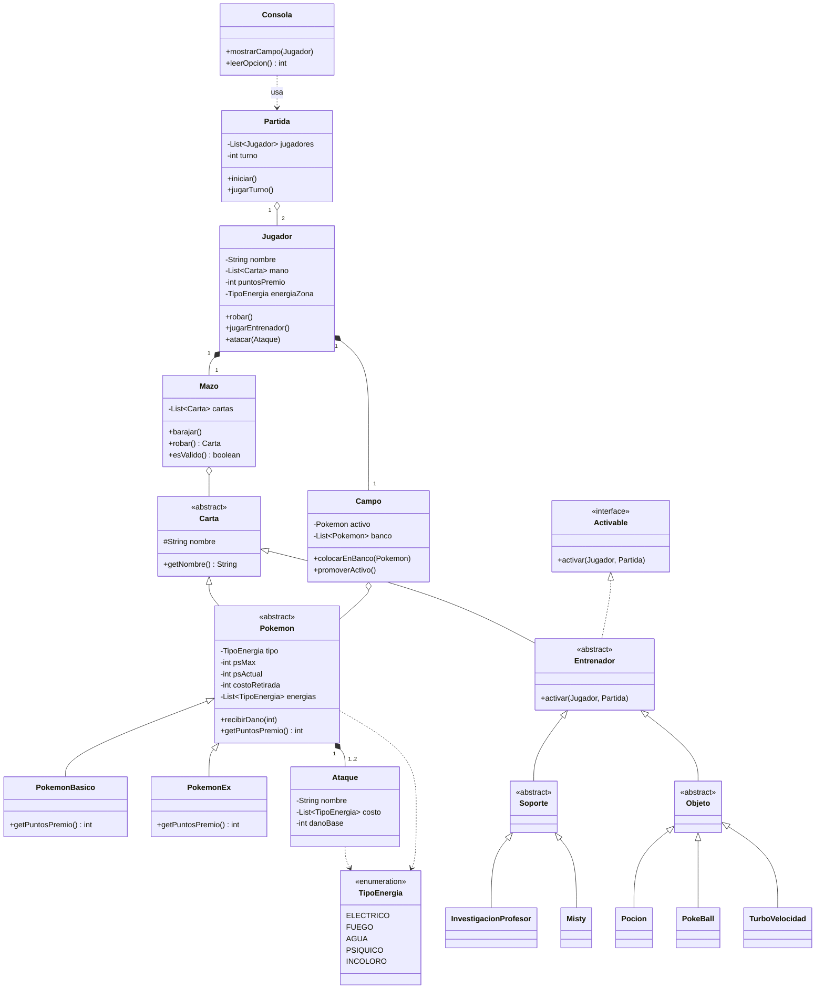

# Diagrama de clases

```mermaid
classDiagram
    class Carta {
        <<abstract>>
        #String nombre
        +getNombre() String
    }

    class Activable {
        <<interface>>
        +activar(Jugador, Partida)
    }

    class Pokemon {
        <<abstract>>
        -TipoEnergia tipo
        -int psMax
        -int psActual
        -int costoRetirada
        -List~TipoEnergia~ energias
        +recibirDano(int)
        +getPuntosPremio() int
    }

    class PokemonBasico {
        +getPuntosPremio() int
    }

    class PokemonEx {
        +getPuntosPremio() int
    }

    class Ataque {
        -String nombre
        -List~TipoEnergia~ costo
        -int danoBase
    }

    class TipoEnergia {
        <<enumeration>>
        ELECTRICO
        FUEGO
        AGUA
        PSIQUICO
        INCOLORO
    }

    class Entrenador {
        <<abstract>>
        +activar(Jugador, Partida)
    }

    class Soporte {
        <<abstract>>
    }

    class Objeto {
        <<abstract>>
    }

    class InvestigacionProfesor
    class Misty
    class Pocion
    class PokeBall
    class TurboVelocidad

    class Consola {
        +mostrarCampo(Jugador)
        +leerOpcion() int
    }

    class Partida {
        -List~Jugador~ jugadores
        -int turno
        +iniciar()
        +jugarTurno()
    }

    class Jugador {
        -String nombre
        -List~Carta~ mano
        -int puntosPremio
        -TipoEnergia energiaZona
        +robar()
        +jugarEntrenador()
        +atacar(Ataque)
    }

    class Mazo {
        -List~Carta~ cartas
        +barajar()
        +robar() Carta
        +esValido() boolean
    }

    class Campo {
        -Pokemon activo
        -List~Pokemon~ banco
        +colocarEnBanco(Pokemon)
        +promoverActivo()
    }

    Carta <|-- Pokemon
    Carta <|-- Entrenador
    Pokemon <|-- PokemonBasico
    Pokemon <|-- PokemonEx

    Activable <|.. Entrenador
    Entrenador <|-- Soporte
    Entrenador <|-- Objeto
    Soporte <|-- InvestigacionProfesor
    Soporte <|-- Misty
    Objeto <|-- Pocion
    Objeto <|-- PokeBall
    Objeto <|-- TurboVelocidad

    Pokemon "1" *-- "1..2" Ataque
    Ataque ..> TipoEnergia
    Pokemon ..> TipoEnergia

    Consola ..> Partida : usa
    Partida "1" o-- "2" Jugador
    Jugador "1" *-- "1" Mazo
    Jugador "1" *-- "1" Campo
    Campo o-- Pokemon
    Mazo o-- Carta
```